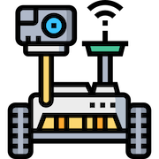
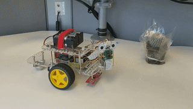
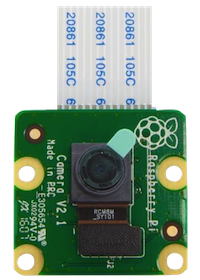
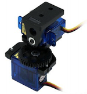
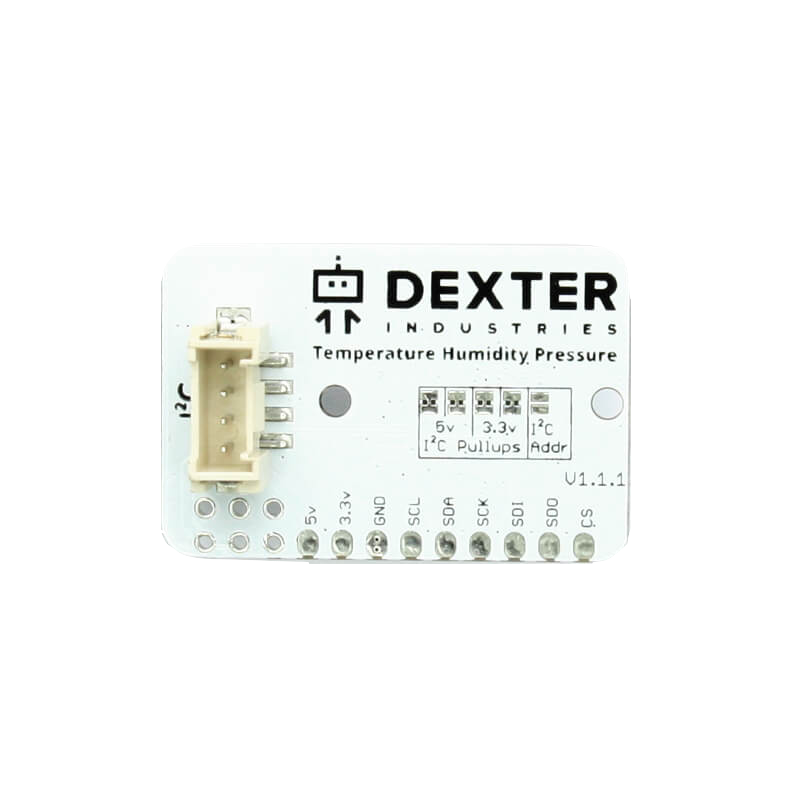
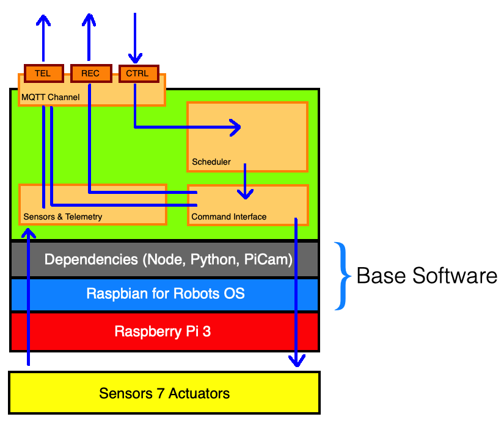
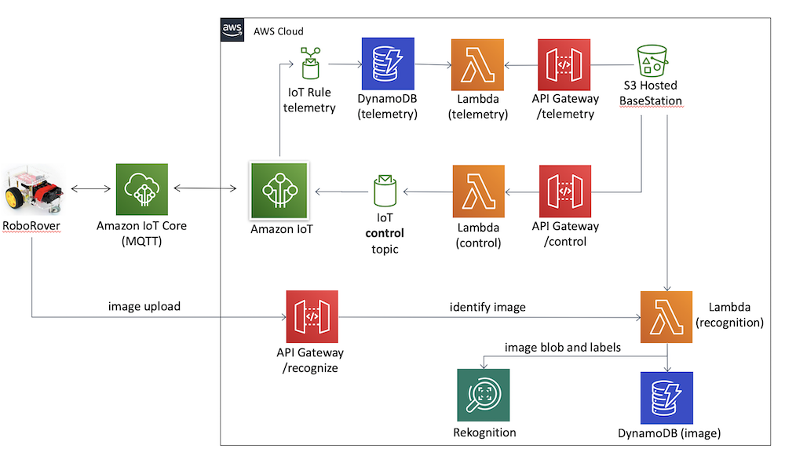

# RoboRover



----

RoboRover is a two-wheeled robot equipped with a pan/tilt camera and sensors, controlled via REST APIs through AWS IoT 
infrastructure and integrated into AWS Rekognition (object detection & classification) service.

RoboRover was originally meant to be part of an introductory course to Robotics, Machine Learning, Cloud and APIs but due
to unforseen circumstances, that is no longer the case.

Instead, I've decided to open source the entire codebase. This will serve as a great introduction to robotics, cloud, machine learning,
HTTP REST APIs, IoT and a bunch of other interesting general software engineering concepts and algorithms.



----

## Project Structure

RoboRover comes in 3 parts:

1. RoboRover base hardware
2. Roborover base software dependencies (Raspbian for Robots OS, dependencies); and
3. Application stack (Basestation UI, Infrastructure & roverOS Services)

### RoboRover Base Hardware

RoboRover is built upon an existing robotics platform from [Dexter] Industries, and can be purchased here in it's entirety: [GoPiGo3]. 
The base kit costs around `$100` and includes the most essential components (without the Raspberry Pi):

- Primary controller board
- Chassis (frame, wheels, hardware)
- Motors
- Encoders
- Power battery pack & cables

You can purchase the complete kit for `$200` that comes with additional hardware:

- Raspberry Pi 3
- Camera / Distance Sensor Mounts
- Distance Sensor
- microSD Card
- Power Supply wall adapter
- Ethernet cable

**You can buy the individual parts from the manifacturer, particularly if you have your own Raspberry Pi 3 (or 4).**

#### Additional Hardware

The original kit comes only with a distance sensor, so you will have to purchase some additional hardware if you want to give your RoboRover some eyes :)

##### Pan / Tilt 2-Axis Servo Package and Pi Camera

- Raspberry Pi [Camera]



- [Servo] Motor Package



The single servo motor setup will only give your camera single axis `pan` capabilities, so if you'd like to have `tilt` capabilites too, you will
need to purchase an additional Servo Motor Package. I recommend getting a `pan\tilt` combo kit mount. Here is an example kit: [PanTiltKit]

##### Environment Sensor

If you'd like to purchase additional sensors, you may do so from Dexter Industries website. I've purchased the Temperature Humidity Pressure sensor,
and data captured will be offloaded as part of the `telemetry payload`. They have other sensors, however, you will need to extend my original code-base
and expose those measurements if you wish to do so.



### RoboRover Base Software Stack

The RoboRover software stack will be divided in few parts, but first we need to make sure that once we've assembled the RoboRover, we install all
of the dependencies required to successfully run `roverOS` services on top.




#### Raspbian for Robots Operating System

[Dexter] Industries has two different options when it comes to the Raspberry Pi's operating system for your robotics projects. RoboRover prefers
that you install Raspbian for Robots instead of DexterOS, since DexterOS is better suited to teaching and learning with "drag-and-drop" style of
programming. Raspbian, on the other hand, is more suitable for OEM-type projects, and more control of the underlying operating system.

To install Raspbian for Robots, please select either or both of the below links:

- YouTube Video: https://www.youtube.com/watch?v=1J8AAww6Ucw
- [Dexter] Industries How-To: https://www.dexterindustries.com/howto/install-raspbian-for-robots-image-on-an-sd-card/

*NOTE* You also need to make sure to configure your RoboRover to connect to your Wi-Fi network (and the internet), by configuring connectivity
settings. Please visit [Connecting] to your Raspberry Pi and configuring WiFi. (Also make sure you enable SSH)

#### Dependencies

Although Raspbian for Robots comes pre-installed with dependencies, make sure they are all there and up to date.

1. Upate Operating System and Hardware Profiles
```
$ sudo apt-get update
$ sudo apt-get upgrade
```

2. Install latest Node
```
$ wget https://nodejs.org/dist/v13.9.0/node-v13.9.0-linux-armv7l.tar.gz
$ tar -xzf node-v13.9.0-linux-armv7l.tar.gz
$ cd node-v13.9.0-linux-armv7l/
$ sudo cp -R * /usr/local/
```

Check if node and npm has been installed corretly:
```
$ node -v
$ npm -v
```

2. Install latest Python
```
$ sudo apt-get install -y build-essential tk-dev libncurses5-dev libncursesw5-dev libreadline6-dev libdb5.3-dev libgdbm-dev libsqlite3-dev libssl-dev libbz2-dev libexpat1-dev liblzma-dev zlib1g-dev libffi-dev
$ wget https://www.python.org/ftp/python/3.7.0/Python-3.7.0.tgz
$ sudo tar zxf Python-3.7.0.tgz
$ cd Python-3.7.0
$ sudo ./configure
$ sudo make -j 4
$ sudo make altinstall
```

Check for correct version:
```
$ python3.7 -V
```

Make Python3.7 the default version:
```
$ nano ~/.bashrc
```

Add the following alias:
```
alias python='/usr/local/bin/python3.7'
```

and source the .bashrc file:
```
$ source ~/.bashrc
```

Check for correct version:
```
$ python -V
Python 3.7.0
```

### RoboRover Application Architecture

Finally!!!! Here comes the fun part :)


Top-level RoboRover Architecture

The RoboRover Application Architecture comes in 3 parts, and we will discuss each individually.

***NOTE: Infrastructure needs to be deployed first***

### Infrastructure

RoboRover `infrastructure` is fully hosted on AWS Cloud. It provides the primary conduit for RoboRover's telemetry, control and offloading of images for processing
by AWS' Machine Learning services, namely AWS Rekognition.

The entire infrastructure stack is created using `serverless` framework. Infrastructure lives in `infrastructure` folder. To create the RoboRover infrastructure, run
the `roborover` CLI from the root of the repository:

```
$ ./roborover deploy <infrastructure|infra>
```

***NOTE: Make sure that you configure your default `AWS_DEFAULT_PROFILE` profile, so that you are deploying the infrastructure to the right AWS account.***


### roverOS

RoboRover `roverOS` is a simple Node based operating system. It runs on RoboRover Raspbian for Robots OS as a background service. It's primary purpose is:

1. Connecting to the AWS IoT infrastructure via an MQTT (Message Queueing Telemetry Transport) protocol. MQTT is a light-weight protocol used on connecting IoT
devices. RoboRover can loosely be classified as an IoT device.
2. Receiving control commands via IoT infrastructure
3. Scheduling command execution via a command scheduler
4. Interfacing directly with RoboRover's hardware via a SDK, written by the good people of [Dexter] Industries, specifically for GoPiGo3 board.
5. Collecting and sending telemetry (sensor readings, or GPS location if you decide to integrate a GPS sensor)

Once you have assembled your RoboRover, installed all of the dependencies and connected to your WiFi network, deployed the infrastructure (previous step), you can
proceed to install the `roverOS` by simply running the following command from the repository root:

```
$ ./roborover setup
```

The setup will run through the following:
1. Create certificates required by the IoT infrastructure for secure MQTT communication
2. Generate HTTP REST API endpoints
3. Package, transfer and install `roverOS` on the RoboRover (by connecting directly via SSH)
4. Run `roverOS` in the background

NOTE:
You may also like to provide additional parameters to the `roborover setup`:
```
# Usage: ./roborover setup <env> <region> 
$ ./roborover setup prod ap-southeast-2 
```

### Basestation UI

```
$ ./roborover deploy <basestation|base>
```

## Support

For support, please please raise a support ticket or reach out on [LinkedIn] :)

[Connecting]: https://www.dexterindustries.com/GoPiGo/get-started-with-the-gopigo3-raspberry-pi-robot/2-connect-to-the-gopigo-3/Raspbian-For-Robots-Operating-System/
[PanTiltKit]: https://www.servocity.com/spt50
[Servo]: https://shop.dexterindustries.com/shop/sensors-accessories/sensors-actuators/servo-package
[Camera]: https://shop.dexterindustries.com/shop/sensors-accessories/sensors-actuators/raspberry-pi-camera
[Dexter]: https://www.dexterindustries.com/
[GoPiGo3]: https://www.dexterindustries.com/gopigo3/
[Serverless]: https://serverless.com/
[LinkedIn]: https://www.linkedin.com/in/sasasavic/
